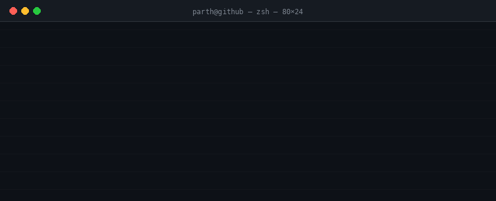
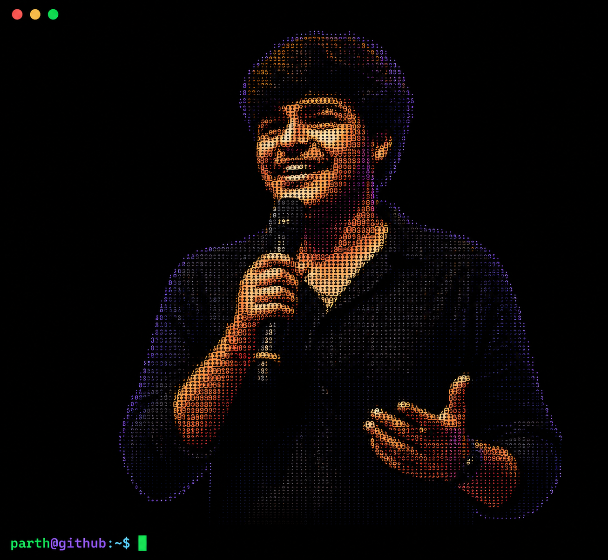

<!-- HEADER -->
<div align="center">
  
</div>

<p align="center">
  <a href="https://www.linkedin.com/in/parth-kumar-singh-527378229/">
    
  </a>
  &nbsp;
  <a href="mailto:parthksingh1@gmail.com">
    
  </a>
  &nbsp;
  <a href="https://github.com/parthksingh1">
    
  </a>
</p>


<!-- ABOUT -->

<h2>⚡ About Me</h2>

<table>
  <tr>
    <td width="42%" align="center">
      
    </td>
    <td width="58%">

```
parth@github
──────────────────────────────────
 OS        B.Tech CS @ IIITDM Jabalpur '26
 Host      Vadodara, India 🇮🇳
 Kernel    TypeScript · Python · C++ · Go

 Frontend  Next.js 15 · React · Tailwind · Framer Motion
 Backend   Node.js · FastAPI · Kafka · Redis · WebSockets
 Storage   PostgreSQL · pgvector · MongoDB · ClickHouse
 AI        LangChain · OpenAI · Gemini · RAG · MCP
 Cloud     Docker · Kubernetes · GCP · Terraform

 Uptime    Meta HackerCup R3 #186 · CodeChef #76
 Packages  1000+ LeetCode Problems Solved
 Status    Open to remote AI / full-stack roles
```

   </td>
  </tr>
</table>

<br/>


<!-- CP SECTION -->

<h2>🏆 Competitive Programming</h2>

<div align="center">
<br/>


&nbsp;

&nbsp;


<br/><br/>
</div>


<!-- TECH STACK -->

<h2>🛠️ Tech Stack</h2>

<div align="center">

**Frontend**


**Backend & Databases**


**AI / ML**


&nbsp;


**DevOps & Cloud**


**Tools**


</div>


<!-- PROJECTS -->

<h2>🚀 Featured Projects</h2>

<div align="center">
<table>
<tr>

<td width="50%" valign="top">

### 🤖 NexusAI
**Autonomous AI Agent OS**

Full-blown agent platform with ReAct orchestration, advanced RAG (HyDE + hybrid search + cross-encoder re-ranking), Monaco code agent with Docker/gVisor sandbox, and a live agent marketplace with Prometheus LLMOps.

`Next.js 15` `FastAPI` `Kafka` `pgvector` `ClickHouse` `K8s`

✦ Multi-agent orchestration via Kafka event bus  
✦ HyDE + hybrid search + re-ranking RAG pipeline  
✦ Sandboxed code execution with gVisor  

</td>

<td width="50%" valign="top">

### 🌐 CollabSpace
**Real-Time Collaboration OS**

Team workspace with CRDT-based conflict-free editing, AI context-aware assistance, and a Kafka event backbone — 356+ files, built for production scale.

`Next.js` `TypeScript` `Kafka` `Redis` `Yjs CRDT`

✦ Conflict-free real-time editing via Yjs CRDTs  
✦ AI suggestions baked into the editor layer  
✦ Sub-100ms sync via Redis pub/sub  

</td>

</tr>
<tr>

<td width="50%" valign="top">

### ♻️ ZeroWasteLink 2.0
**Smart Food Redistribution Platform**

Connects food donors with NGOs in real time — reducing waste and fighting hunger through tech. Live Leaflet.js map, Socket.io event pipeline, and a smart matching engine.

`Next.js` `MongoDB` `Socket.io` `Leaflet.js` `GCP`

✦ Live donor-NGO map with real-time alerts  
✦ Intelligent matching algorithm  
✦ Analytics dashboard, fully responsive  

</td>

<td width="50%" valign="top">

### ⚙️ TaskForge
**Distributed Task Queue Engine**

High-throughput task queue with Redis priority scheduling, atomic Lua scripts, PostgreSQL persistence, and real-time job status streaming — built to handle serious workloads.

`TypeScript` `Redis` `PostgreSQL` `Lua`

✦ Atomic Lua scripts for race-condition-free ops  
✦ Worker pool management with retry logic  
✦ Real-time job status via WebSocket  

</td>

</tr>
</table>
</div>

<p align="center">
  <a href="https://github.com/parthksingh1?tab=repositories">
    
  </a>
</p>


<!-- STATS -->

<h2>📊 GitHub Analytics</h2>

<div align="center">
  <picture>
    <source media="(prefers-color-scheme: dark)" srcset="https://github-readme-stats-sigma-five.vercel.app/api?username=parthksingh1&show_icons=true&theme=tokyonight&hide_border=true&count_private=true&cache_seconds=86400&title_color=22c55e&icon_color=22c55e&text_color=c9d1d9&bg_color=0d1117" />
    <source media="(prefers-color-scheme: light)" srcset="https://github-readme-stats-sigma-five.vercel.app/api?username=parthksingh1&show_icons=true&theme=default&hide_border=true&count_private=true&cache_seconds=86400" />
    
  </picture>
  &nbsp;
  <picture>
    <source media="(prefers-color-scheme: dark)" srcset="https://github-readme-stats-sigma-five.vercel.app/api/top-langs/?username=parthksingh1&layout=compact&theme=tokyonight&hide_border=true&cache_seconds=86400&title_color=22c55e&text_color=c9d1d9&bg_color=0d1117" />
    <source media="(prefers-color-scheme: light)" srcset="https://github-readme-stats-sigma-five.vercel.app/api/top-langs/?username=parthksingh1&layout=compact&theme=default&hide_border=true&cache_seconds=86400" />
    
  </picture>
</div>

<br/>

<div align="center">
  
</div>

<br/>

<div align="center">
  
</div>

<br/>

<div align="center">
  
</div>


<!-- CONNECT -->

<h2>🤝 Let's Connect</h2>

<p align="center">
  <a href="https://www.linkedin.com/in/parth-kumar-singh-527378229/">
    
  </a>
  &nbsp;
  <a href="mailto:parthksingh1@gmail.com">
    
  </a>
  &nbsp;
  <a href="https://github.com/parthksingh1">
    
  </a>
</p>

<br/>

<div align="center">
  
</div>

<!-- FOOTER -->
<p align="center">
  
</p>

<p align="center">
  <sub>If my work resonates with you, a ⭐ goes a long way · <b>Parth Kumar Singh</b></sub>
</p>
