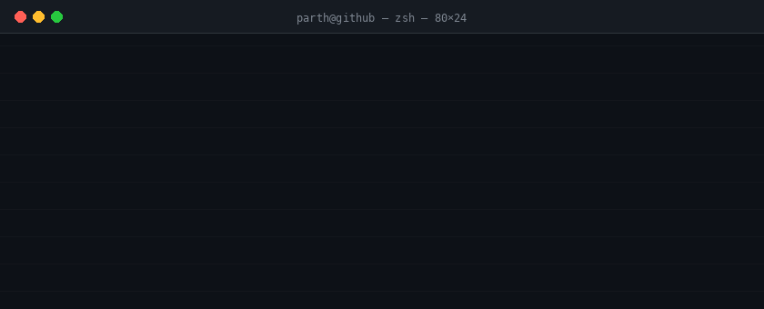
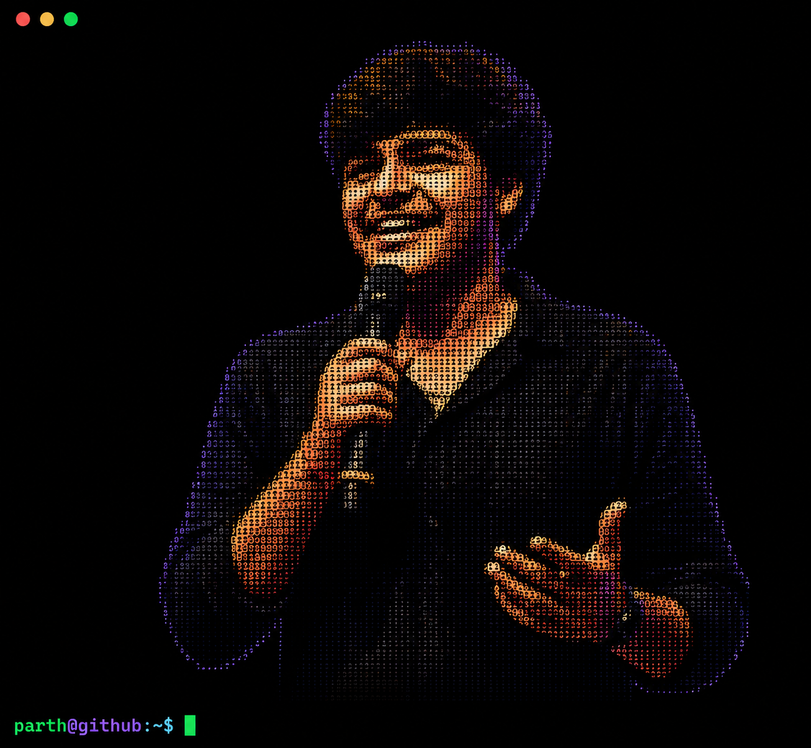

<!-- HEADER -->
<div align="center">
  
</div>


<!-- ABOUT -->

<h2>⚡ About Me</h2>

<table>
  <tr>
    <td width="42%" align="center">
      
    </td>
    <td width="58%">

```
parthksingh1@github
──────────────────────────────────
 OS          B.Tech CS @ IIITDM Jabalpur '26
 Host        Vadodara, India 🇮🇳
 Kernel      TypeScript · Python · C++ · Go

 Frontend    Next.js 15 · React · Tailwind · Framer Motion
 Backend     Node.js · FastAPI · Kafka · Redis · WebSockets
 Storage     PostgreSQL · pgvector · MongoDB · ClickHouse
 AI/ML       LangChain · OpenAI · Gemini · RAG · MCP · LangGraph
 Cloud       Docker · Kubernetes · GCP · Terraform · CI/CD

 Projects    CollabSpace · TaskForge · MedEaseAI · NexusAI
 Freelance   DevCraft Studio — AI-powered builds for startups
 Open Source Keploy (Go · Node.js) · mcp-observer
 Experience  Akatsuki AI — Slack bot · Gemini · python-pptx

 Uptime      Meta HackerCup R3 #186 · CodeChef #76
 Packages    1000+ LeetCode Problems Solved
 Arch        Distributed systems · real-time · multi-agent AI
 Shell       Building toward indie SaaS revenue

 Status      Open to remote AI / full-stack · YC-backed · Series A–B
 Contact     Topmate.io/parth · DevCraft Studio
──────────────────────────────────
>_ building things that ship, scale, and sometimes win hackathons
```

   </td>
  </tr>
</table>

<br/>

<p align="center">
  <a href="https://www.linkedin.com/in/parth-kumar-singh-527378229/">
    
  </a>
  &nbsp;
  <a href="mailto:parthksingh1@gmail.com">
    
  </a>
  &nbsp;
  <a href="https://github.com/parthksingh1">
    
  </a>
</p>


<!-- CP SECTION -->

<h2>🏆 Competitive Programming</h2>

<div align="center">
<br/>


&nbsp;

&nbsp;


<br/><br/>
</div>


<!-- TECH STACK -->

<h2>🛠️ Tech Stack</h2>

<div align="center">

**Languages**


**AI / ML & LLMs**


**RAG & Vector DBs**


**Frontend**


**Backend & Databases**


**DevOps, Cloud & Observability**


**Tools**


</div>


<!-- PROJECTS -->

<h2>🚀 Featured Projects</h2>

<table>
<tr>
<td width="50%" valign="top" align="center">

<h3>🤖 NexusAI</h3>
<b>Autonomous AI Agent OS</b><br>
<sub>ReAct multi-agent orchestration, multi-LLM router with fallback, HyDE + hybrid RAG and a gVisor code sandbox</sub>
<br><br>
<code>🧠 Claude · GPT · Gemini</code> <code>⚡ Kafka event bus</code>
<br><br>
<kbd>Next.js</kbd> <kbd>FastAPI</kbd> <kbd>Kafka</kbd> <kbd>pgvector</kbd> <kbd>K8s</kbd>

</td>
<td width="50%" valign="top" align="center">

<h3>🔌 MCPHub</h3>
<b>Every MCP server, one hub</b><br>
<sub>A central hub that collects Model Context Protocol servers so agents and devs can plug in tools fast</sub>
<br><br>
<code>🌍 Open source</code> <code>🤖 Agent ready</code>
<br><br>
<kbd>MCP</kbd> <kbd>TypeScript</kbd> <kbd>Python</kbd>

</td>
</tr>
<tr>
<td width="50%" valign="top" align="center">

<h3>🔍 AgenticRAG</h3>
<b>Multi-tenant RAG + evals-gated CI</b><br>
<sub>Hybrid BM25 + pgvector retrieval, cross-encoder reranking, 4 MCP servers and LLM-as-judge gates on every PR</sub>
<br><br>
<code>📈 Faithfulness 0.71 → 0.91</code> <code>⚡ TTFT 4.2s → 1.6s</code>
<br><br>
<kbd>LangGraph</kbd> <kbd>FastAPI</kbd> <kbd>pgvector</kbd> <kbd>Ragas</kbd>

</td>
<td width="50%" valign="top" align="center">

<h3>⚡ DistillServe</h3>
<b>LLM distillation + vLLM serving</b><br>
<sub>Distilled a frontier model into a LoRA-tuned 8B model, served on vLLM + KServe with FP8</sub>
<br><br>
<code>🎯 97.4% quality @ 7% cost</code> <code>🚀 3.1K tok/s per H100</code>
<br><br>
<kbd>PyTorch</kbd> <kbd>LoRA</kbd> <kbd>vLLM</kbd> <kbd>KServe</kbd>

</td>
</tr>
<tr>
<td width="50%" valign="top" align="center">

<h3>🔀 LLMRouter</h3>
<b>LLM gateway: route · cache · guard</b><br>
<sub>OpenAI-compatible gateway over 5 providers with mid-stream failover, semantic cache and PII guardrails</sub>
<br><br>
<code>💰 -52% spend</code> <code>⚡ 47% cache hits</code>
<br><br>
<kbd>Go</kbd> <kbd>Redis</kbd> <kbd>Qdrant</kbd> <kbd>ClickHouse</kbd>

</td>
<td width="50%" valign="top" align="center">

<h3>🌐 CollabSpace</h3>
<b>Real-time collaboration OS</b><br>
<sub>CRDT conflict-free editing with AI assistance on a Kafka + Redis event backbone</sub>
<br><br>
<code>🔥 50K+ live sockets</code> <code>⚡ &lt;30ms sync</code>
<br><br>
<kbd>Next.js</kbd> <kbd>Yjs</kbd> <kbd>Kafka</kbd> <kbd>Redis</kbd>

</td>
</tr>
<tr>
<td width="50%" valign="top" align="center">

<h3>🧵 TaskForge</h3>
<b>Distributed task queue engine</b><br>
<sub>Redis priority queue with atomic Lua scripts, visibility timeouts, retries and live job streaming</sub>
<br><br>
<code>🔒 Race-free Lua ops</code> <code>✅ At-least-once delivery</code>
<br><br>
<kbd>TypeScript</kbd> <kbd>Redis</kbd> <kbd>PostgreSQL</kbd> <kbd>Lua</kbd>

</td>
<td width="50%" valign="top" align="center">

<h3>♻️ ZeroWasteLink</h3>
<b>Smart food redistribution</b><br>
<sub>Matches food donors with NGOs in real time on a live map with instant alerts</sub>
<br><br>
<code>🗺️ Live donor map</code> <code>🤝 Smart matching</code>
<br><br>
<kbd>Next.js</kbd> <kbd>MongoDB</kbd> <kbd>Socket.io</kbd> <kbd>GCP</kbd>

</td>
</tr>
</table>
</div>

<p align="center">
  <a href="https://github.com/parthksingh1?tab=repositories">
    
  </a>
</p>


<!-- STATS -->

<h2>📊 GitHub Analytics</h2>

<div align="center">


  


</div>

<br/>

<div align="center">
  
</div>

<br/>

<div align="center">
  
</div>

<br/>

<div align="center">
  
</div>


<br/>
<br/>

<picture>
  <source media="(prefers-color-scheme: dark)"
          srcset="https://raw.githubusercontent.com/parthksingh1/parthksingh1/output/pacman-contribution-graph-dark.svg">
  <source media="(prefers-color-scheme: light)"
          srcset="https://raw.githubusercontent.com/parthksingh1/parthksingh1/output/pacman-contribution-graph.svg">
  
</picture>

<br/>
<br/>


<!-- CONNECT -->
<!-- CONNECT -->
<h2 align="center">⚡ Let's Build Something Together</h2>

<p align="center">
  <a href="https://www.linkedin.com/in/parth-kumar-singh-527378229/">
    
  </a>
  &nbsp;
  <a href="mailto:parthksingh1@gmail.com">
    
  </a>
  &nbsp;
  <a href="https://github.com/parthksingh1">
    
  </a>
</p>

<br/>

<!-- QUOTE -->
<div align="center">
  
</div>

<br/>

<!-- FOOTER WAVE -->
<p align="center">
  
</p>

<p align="center">
  <sub>
    ⭐ <em>If something here sparked an idea, a star goes a long way.</em>
  </sub>
  <br/>
  <sub>
    <code>&lt;/&gt;</code> with ☕ by <b>Parth Kumar Singh</b>
  </sub>
</p>
